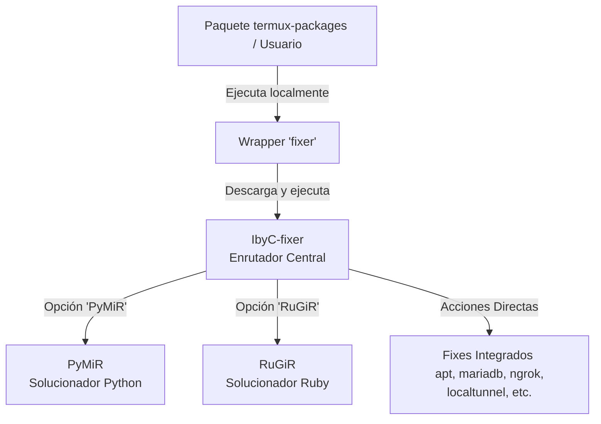

# Automatización de Soluciones: El Wrapper 'fixer' 🛠️

En el ecosistema **i-HakLab** y en las distribuciones personalizadas de **termux-packages**, la automatización de reparaciones y mitigaciones de entorno se centraliza a través de un mecanismo dinámico de diagnóstico y reparación llamado **`fixer`**.

Este componente está diseñado para que cualquier paquete o script de la suite pueda invocar soluciones automáticas ante incompatibilidades comunes en Android/Termux sin requerir intervención manual del usuario.

---

## 🗺️ Arquitectura de Ejecución

El flujo de control de `fixer` sigue un patrón modular y jerárquico, permitiendo enrutar los problemas al motor de reparación adecuado (entorno general, Python o Ruby):



---

## 1. El Wrapper Local (`fixer`)

En cada paquete del repositorio de **termux-packages** (por ejemplo, en los scripts de pre/post-instalación como el de `openjdk-21`), se incluye un wrapper local ultra-ligero llamado `fixer`. 

### Código y Funcionamiento del Wrapper:
Este script local prepara el entorno mínimo y delega la ejecución al script centralizado remoto:

```bash
#!/data/data/com.termux/files/usr/bin/bash
# Verifica e instala dependencias básicas si faltan
if [[ ! $(command -v lolcat) ]] &>/dev/null; then
  if [[ ! $(command -v ruby) ]] &>/dev/null; then
    apt install ruby -y
  fi
  gem install lolcat
fi

if [[ ! $(command -v curl) ]] &>/dev/null; then
  apt install curl -y
fi

# Descarga y ejecuta remotamente el enrutador IbyC-fixer pasando los argumentos del usuario
bash <(curl -fsSL "https://raw.githubusercontent.com/ivam3/i-Haklab/master/.deb/home/.local/libexec/IbyC-fixer") ${@:1}
```

---

## 2. El Enrutador Central: `IbyC-fixer`

Localizado originalmente en `@../i-Haklab/.deb/home/.local/libexec/IbyC-fixer`, actúa como la central de comandos para la resolución de errores. Admite múltiples argumentos y automatiza las siguientes tareas:

| Comando | Acción y Solución Técnica Automatizada |
| :--- | :--- |
| **`apt`** | Repara el gestor de paquetes de Termux (`dpkg --configure -a`, resuelve bloqueos de dependencias, corrige repositorios caídos/no firmados forzando mirrors limpios). |
| **`burpsuite`** | Instala la compilación de transición `openjdk-21-preinst` y configura `burpsuite` en entornos compatibles. |
| **`downgradeRepo`** | Permite degradar la versión de repositorios específicos (ej. Ruby, Python) utilizando repositorios de backup (`abhacker-repo`). |
| **`gemini-cli`** | Fuerza la reconstrucción del módulo nativo `node-pty` de Node.js mediante compilación local (`npm rebuild`) bajo las variables del NDK de Android. |
| **`localtunnel`** | Corrige el fallo crítico `Unsupported platform: android` en LocalTunnel descargando y reemplazando `openurl.js` con un puente compatible. |
| **`mariadb`** | Soluciona el error `access denied for user root` iniciando MariaDB temporalmente en modo seguro (`--skip-grant-tables`), inyectando el password `root` en `mysql.global_priv` (JSON set) y reiniciando el daemon. |
| **`metasploit`** | Instala versiones heredadas de Ruby (como 2.7.2) de manera aislada para posibilitar el arranque estable de Metasploit. |
| **`neovim`** | Descarga y parchea los utilitarios de `bufferline.nvim` para solucionar crashes del tipo `E5108` en terminales Android. |
| **`ngrok`** | Resuelve el clásico error `bad address` envolviendo el binario de Ngrok bajo un entorno virtual de usuario con `termux-chroot`. |
| **`nrauf`** | Script complementario para remapear archivos con nombres Unicode a ASCII después de realizar descompilaciones con `apktool`. |
| **`PyMiR`** | Invoca al subsistema de reparación para módulos problemáticos de Python (ver sección 3). |
| **`RuGiR`** | Invoca al subsistema de reparación para gemas problemáticas de Ruby (ver sección 4). |

---

## 3. `PyMiR`: Solucionador de Módulos Python

Cuando un usuario o paquete invoca `fixer PyMiR -t <tipo> -p <versión> -m <módulos>`, el script `PyMiR` toma el control para compilar e inyectar configuraciones específicas a nivel de C/C++:

* **Gestión de Compilación Compleja:**
  * **Jupyter / PyZMQ:** Remueve flags incompatibles del compilador como `-fno-openmp-implicit-rpath` modificando directamente el archivo `_sysconfigdata` interno de Python. Además, utiliza `patchelf` para inyectar enlaces compartidos (`libpython3.11.so` / `libpython3.12.so`) en las extensiones binarias de Cython.
  * **Pandas / Numpy:** Configura flags de optimización como `CFLAGS="-Wno-deprecated-declarations"` y define librerías matemáticas globales (`MATHLIB="m"`) para evitar fallos de enlazado dinámico.
  * **Modos de Compilación Soportados (`-t`):**
    * `BASIC`: Instalación directa sin caché.
    * `BLAS`: Compilación vinculando directamente la biblioteca OpenBLAS del sistema (`libblas.so`, `liblapack.so`).
    * `CYTHON`: Fuerza la traducción intermedia a C usando Cython.
    * `LDFLAGS`: Limita el cargador de Android forzando `/system/lib/libcompiler_rt` para proveer funciones built-in de C.
    * `RUST`: Habilita temporalmente el compilador de Rust configurando el target móvil de Cargo (`CARGO_BUILD_TARGET`) y remueve el compilador al finalizar para liberar almacenamiento en el dispositivo.
    * `SOURCE-CODE`: Descarga el código fuente de PyPI, aplica `termux-fix-shebang` recursivamente sobre los instaladores y ejecuta la compilación nativa en caliente.

---

## 4. `RuGiR`: Solucionador de Gemas Ruby

El script `RuGiR` (localizado en `@../i-Haklab/.deb/home/.local/libexec/RuGiR`) corrige incompatibilidades en el ecosistema de Ruby:

* **Error de Enlazado de `bigdecimal.so` en Metasploit:**
  * **Causa:** Metasploit en Termux suele crashear al no poder cargar la librería compartida de BigDecimal (`CANNOT LINK EXECUTABLE "ruby"`).
  * **Solución `RuGiR`:** Parchea dinámicamente el wrapper de arranque `/data/data/com.termux/files/usr/bin/msfconsole` forzando la inyección de la librería BigDecimal compilada en la variable de entorno `LD_PRELOAD`:
    ```bash
    export LD_PRELOAD="${BIGDECIMAL_PATH}/bigdecimal.so:$LD_PRELOAD"
    ```
* **Compilación de Gemas Nativas (`grpc`, `xslt`, `nokogiri`):**
  * Configura bundler para forzar el uso de librerías del sistema (`bundle config build.<gem> --using-system-libraries`) y ejecuta `gem pristine` para recompilar las cabeceras nativas contra el entorno NDK de Android.
* **Error de Cifrado OpenSSL (`OpenSSL::Cipher::CipherError`):**
  * Parchea en caliente los archivos internos de gemas de comunicación (como `hrr_rb_ssh`) desactivando algoritmos incompatibles con las políticas criptográficas restrictivas de Android.
