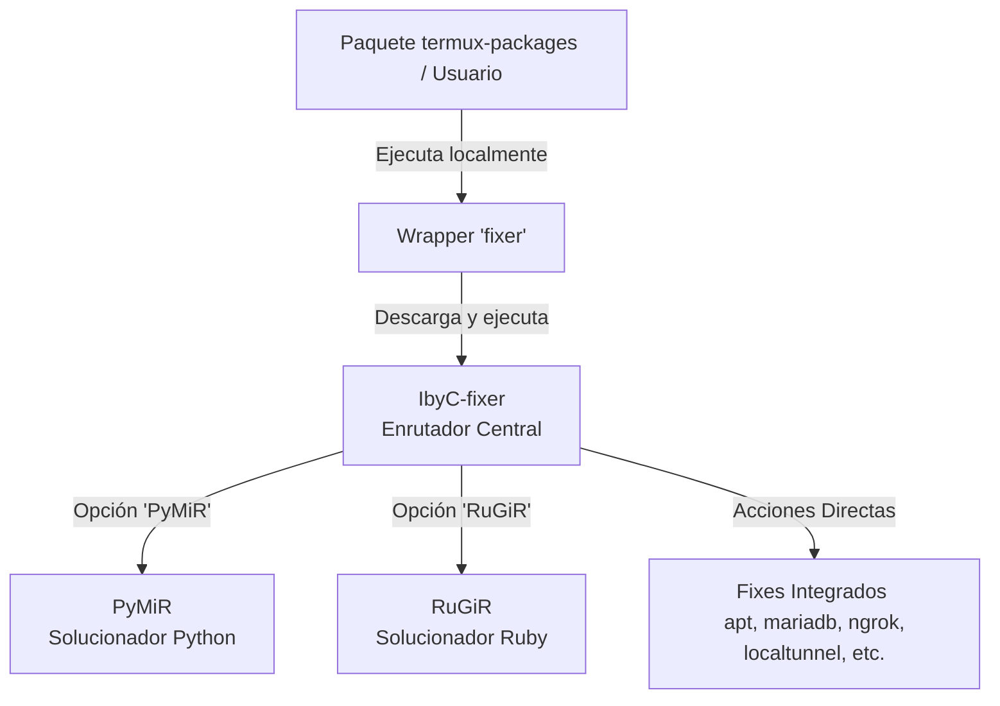

# Automatización de Soluciones: El Wrapper 'fixer' 🛠️

En el ecosistema **i-HakLab** y en las distribuciones personalizadas de **termux-packages**, la automatización de reparaciones y mitigaciones de entorno se centraliza a través de un mecanismo dinámico de diagnóstico y reparación llamado **`fixer`**.

Este componente está diseñado para que cualquier paquete o script de la suite pueda invocar soluciones automáticas ante incompatibilidades comunes en Android/Termux sin requerir intervención manual del usuario.

---

## 🗺️ Arquitectura de Ejecución

El flujo de control de `fixer` sigue un patrón modular y jerárquico, permitiendo enrutar los problemas al motor de reparación adecuado (entorno general, Python o Ruby):



---

## 1. El Wrapper Local (`fixer`)

En cada paquete del repositorio de **termux-packages** (por ejemplo, en los scripts de pre/post-instalación como el de `openjdk-21`), se incluye un wrapper local ultra-ligero llamado `fixer`. 

### Código y Funcionamiento del Wrapper:
Este script local prepara el entorno mínimo y delega la ejecución al script centralizado remoto:

```bash
#!/data/data/com.termux/files/usr/bin/bash
# Verifica e instala dependencias básicas si faltan
if [[ ! $(command -v lolcat) ]] &>/dev/null; then
  if [[ ! $(command -v ruby) ]] &>/dev/null; then
    apt install ruby -y
  fi
  gem install lolcat
fi

if [[ ! $(command -v curl) ]] &>/dev/null; then
  apt install curl -y
fi

# Descarga y ejecuta remotamente el enrutador IbyC-fixer pasando los argumentos del usuario
bash <(curl -fsSL "https://raw.githubusercontent.com/ivam3/i-Haklab/master/.deb/home/.local/libexec/IbyC-fixer") ${@:1}
```

---

## 2. El Enrutador Central: `IbyC-fixer`

Localizado originalmente en `@../i-Haklab/.deb/home/.local/libexec/IbyC-fixer`, actúa como la central de comandos para la resolución de errores. Admite múltiples argumentos y automatiza las siguientes tareas:

| Comando | Acción y Solución Técnica Automatizada |
| :--- | :--- |
| **`apt`** | Repara el gestor de paquetes de Termux (`dpkg --configure -a`, resuelve bloqueos de dependencias, corrige repositorios caídos/no firmados forzando mirrors limpios). |
| **`burpsuite`** | Instala la compilación de transición `openjdk-21-preinst` y configura `burpsuite` en entornos compatibles. |
| **`downgradeRepo`** | Permite degradar la versión de repositorios específicos (ej. Ruby, Python) utilizando repositorios de backup (`abhacker-repo`). |
| **`gemini-cli`** | Fuerza la reconstrucción del módulo nativo `node-pty` de Node.js mediante compilación local (`npm rebuild`) bajo las variables del NDK de Android. |
| **`localtunnel`** | Corrige el fallo crítico `Unsupported platform: android` en LocalTunnel descargando y reemplazando `openurl.js` con un puente compatible. |
| **`mariadb`** | Soluciona el error `access denied for user root` iniciando MariaDB temporalmente en modo seguro (`--skip-grant-tables`), inyectando el password `root` en `mysql.global_priv` (JSON set) y reiniciando el daemon. |
| **`metasploit`** | Instala versiones heredadas de Ruby (como 2.7.2) de manera aislada para posibilitar el arranque estable de Metasploit. |
| **`neovim`** | Descarga y parchea los utilitarios de `bufferline.nvim` para solucionar crashes del tipo `E5108` en terminales Android. |
| **`ngrok`** | Resuelve el clásico error `bad address` envolviendo el binario de Ngrok bajo un entorno virtual de usuario con `termux-chroot`. |
| **`nrauf`** | Script complementario para remapear archivos con nombres Unicode a ASCII después de realizar descompilaciones con `apktool`. |
| **`PyMiR`** | Invoca al subsistema de reparación para módulos problemáticos de Python (ver sección 3). |
| **`RuGiR`** | Invoca al subsistema de reparación para gemas problemáticas de Ruby (ver sección 4). |

---

## 3. `PyMiR`: Python Modules Issue Resolver

Script ubicado en `$PREFIX/libexec/PyMiR`. Se invoca desde `fixer`:

```bash
fixer PyMiR -t <TIPO> -p <2|3> -m <módulo1 módulo2 ...>
```

### Dependencias automáticas

Al ejecutarse, PyMiR instala automáticamente los siguientes paquetes si no están presentes:
`tur-repo`, `build-essential`, `python`, `python-pip`, `python2`, `curl`, `tar`, `wget`, `ruby`, `clang`, `make`, `cmake`, `nodejs`, `pkg-config`, `openblas`, `libgmp`, `libmpc`, `libmpc-static`, `libmpfr`, `libtool`, `libxml2`, `libxml2-static`, `libxml2-utils`, `libxslt`, `libxslt-static`, `libsodium`, `libsodium-static`, `libjpeg-turbo`, `libpng`, `libzmq`, `valac`

### Modos de compilación (`-t`)

| Modo | Descripción | Comportamiento interno |
|------|-------------|----------------------|
| `BASIC` | Instalación directa | Para `pandas`: exporta `CFLAGS="-Wno-deprecated-declarations -Wno-unreachable-code"` + `MATHLIB="m"`, pre-instala Cython, luego `pkg install python-numpy python-pandas`. Para `pyzmq`: `--install-option="--libzmq=$PREFIX/lib/libzmq.so"`. Auto-remueve `rust` y `~/.cargo` post-instalación |
| `BLAS` | OpenBLAS del sistema | Exporta `BLAS=$PREFIX/lib/libblas.so`, `LAPACK=$PREFIX/lib/liblapack.so`, `CC=clang`, `CPP=clang++` |
| `CYTHON` | Traducción intermedia a C | Instala `Cython` primero, exporta `MATHLIB="m"` |
| `LDFLAGS` | Linker del sistema | Exporta `LDFLAGS="-L/system/lib/ -lm -lcompiler_rt"`, pasa `--global-option="build_ext" --global-option="--disable-jpeg"` |
| `RUST` | Compilador Rust temporal | Instala `rust`, exporta `RUSTFLAGS="-C lto=no"` y `CARGO_BUILD_TARGET`, post-instalación remueve `rust` y `~/.cargo` |
| `SC` (SOURCE-CODE) | Código fuente PyPI | Descarga `.zip` desde PyPI, extrae, ejecuta `termux-fix-shebang` recursivo en todos los archivos, `python setup.py install` |
| `S` (SODIUM) | Sodium decryptor | Exporta `SODIUM_INSTALL=system`, instala con `--no-binary :all:` |

### Módulos con instalación vía `apt` (auto-detectados)

Cuando el nombre del módulo coincide con alguno de estos, PyMiR redirige a `pkg install` en lugar de `pip install`:

| Módulo | Paquete apt |
|---------|-------------|
| `apsw` | `python-apsw` |
| `apt` | `python-apt` |
| `bcrypt` | `python-bcrypt` |
| `contourpy` | `python-contourpy` |
| `cryptography` | `python-cryptography` |
| `numpy` | `python-numpy` |
| `pillow` | `python-pillow` |
| `tkinter` | `python-tkinter` |
| `tldp` | `python-tldp` |
| `xcbgen` | `python-xcbgen` |
| `opencv` | `opencv-python` |
| `scipy` | `python-scipy` o `python2-scipy` (usa repositorio its-pointless) |
| `electrum` | `electrum` (apt directo) |
| `asciinema` | `asciinema` (apt directo) |
| `matplotlib` | `matplotlib` (apt directo) |
| `pandas` | `python-pandas` (apt directo) |

### Módulos especiales

**`turtle`:**
PyMiR descarga un `tar.gz` desde el repositorio i-HakLab, aplica un `sed` para corregir sintaxis Python 2→3 en `setup.py` (`except ValueError, ve:` → `except (ValueError, ve):`) y ejecuta `pip install -e`.

**`jupyter`:**
1. Localiza `_sysconfigdata_*.py` en `$LIBPY`
2. Instala `clang`, `binutils`, `maturin`, `pyzmq`, `patchelf`
3. Aplica `sed -i 's|-fno-openmp-implicit-rpath||g'` en `_sysconfigdata.py`
4. Instala `jupyter` vía pip
5. Ejecuta `patchelf --add-needed libpython3.11.so` sobre `_zmq.cpython-311.so`
6. Instala `matplotlib` vía apt
7. Purga `rust`

### Ejemplos

```bash
# Instalar pandas en modo BASIC con Python 3
fixer PyMiR -t BASIC -p 3 -m pandas

# Compilar numpy con OpenBLAS
fixer PyMiR -t BLAS -p 3 -m numpy

# Varios módulos con Rust
fixer PyMiR -t RUST -p 3 -m cryptography bcrypt

# Instalar Jupyter completo
fixer PyMiR -t BASIC -p 3 -m jupyter

# Forzar compilación desde código fuente
fixer PyMiR -t SC -p 3 -m mymodule

# Usar sodium decryptor con Python 2
fixer PyMiR -t S -p 2 -m colorama requests
```

---

## 4. `RuGiR`: Ruby Gems Issue Resolver

Script ubicado en `$PREFIX/libexec/RuGiR`. Se invoca desde `fixer` y presenta un menú interactivo con 7 opciones:

```bash
fixer RuGiR
```

### Opciones del menú interactivo

#### Opción 1 — MSFCONSOLE: BigDecimal linking para Metasploit
**Causa:** Metasploit crashea con `CANNOT LINK EXECUTABLE "ruby"` — `bigdecimal.so` no se encuentra.

**Solución:** Re-genera `$PREFIX/bin/msfconsole` con:
- `LD_PRELOAD` apuntando a `bigdecimal.so` detectado automáticamente en `$PREFIX/lib/ruby/<version>/`
- Auto-arranque de PostgreSQL: `initdb`, `pg_ctl start`, `createuser msf`, `createdb msf_database`
- Enlace simbólico `msfconsole → msfvenom`

```bash
export LD_PRELOAD="${BIGDECIMAL}:\$LD_PRELOAD"
if [ ! -d "$PREFIX/var/lib/postgresql" ]; then
    mkdir -p "$PREFIX/var/lib/postgresql"
    initdb "${PREFIX}/var/lib/postgresql"
fi
if ! pg_ctl -D "${PREFIX}/var/lib/postgresql" status > /dev/null 2>&1; then
    pg_ctl -D "${PREFIX}/var/lib/postgresql" start --silent
fi
```

#### Opción 2 — GRPC.GEMSPEC: Limpieza de paquetes
**Causa:** Error al parsear Gemfile por dependencias corruptas.

**Solución:** Ejecuta limpieza completa del gestor de paquetes:
```bash
pkg clean && pkg autoclean && pkg autoremove
pkg update --fix-missing && pkg --configure -a
pkg upgrade && pkg install clang
```

#### Opción 3 — GEMS: Instalación de gemas faltantes
**Causa:** `Could not find <gem> in any of the sources`.

**Solución interactiva:** Solicita nombre de la gema, versión y ruta del Gemfile, luego:
1. `gem install bundler`
2. `gem install <gema> -v "<version>" -- --using-system-libraries`
3. `bundle config build.<gema> --using-system-libraries`
4. Genera `Gemfile.local` con la ruta de extensión
5. Elimina `rbnacl` de `Gemfile.lock`
6. `bundle install --gemfile Gemfile.local && bundle update <gema> --full-index`

#### Opción 4 — GEMS: Mismatch de versión libxslt
**Causa:** Gema compilada contra libxslt X.X.X pero dinámicamente cargando Y.Y.Y.

**Solución interactiva:** Solicita nombre de la gema y método de instalación (bundler o gem), luego ejecuta:
- `bundle exec gem pristine <gema>` o `gem pristine <gema>`

#### Opción 5 — BIGDECIMAL: Compatibilidad de arquitectura
**Causa:** La gema bigdecimal se compiló para una arquitectura incompatible.

**Solución:** Descarga y ejecuta script remoto de reparación:
```bash
curl -Ls https://github.com/ivam3/i-Haklab/raw/master/.set/fix-tools/fixbigdecimal | bash
```

#### Opción 6 — BUNDLER: Mismatch de versión
**Causa:** `You have already activated bundler X.X.X, but your Gemfile requires bundler Y.Y.Y`.

**Solución interactiva:** Solicita versión antigua y nueva, luego:
1. `gem install bundler:<new_version>`
2. Elimina `$PREFIX/lib/ruby/gems/<version>/specifications/default/bundler-<old_version>.gemspec`

#### Opción 7 — MSFCONSOLE: OpenSSL::Cipher::CipherError
**Causa:** Algoritmos de cifrado incompatibles con las políticas criptográficas de Android en la gema `hrr_rb_ssh`.

**Solución:** Parchea archivos de `hrr_rb_ssh-0.4.2` comentando líneas con `sed`:
```bash
GEMPATH=$PREFIX/lib/ruby/gems/<version>/gems/hrr_rb_ssh-0.4.2/lib/hrr_rb_ssh/transport
sed -i '13,15 {s/^/#/}' $GEMPATH/encryption_algorithm/functionable.rb
for i in 256 384 521; do
    sed -i '14 {s/^/#/}' $GEMPATH/server_host_key_algorithm/ecdsa_sha2_nistp$i.rb
done
```

### Ejemplos

```bash
# Reparar msfconsole con bigdecimal + PostgreSQL
fixer RuGiR → opción 1

# Limpiar entorno de gemas corruptas
fixer RuGiR → opción 2

# Instalar gema faltante con soporte nativo
fixer RuGiR → opción 3 → nokogiri

# Corregir OpenSSL en hrr_rb_ssh
fixer RuGiR → opción 7
```
