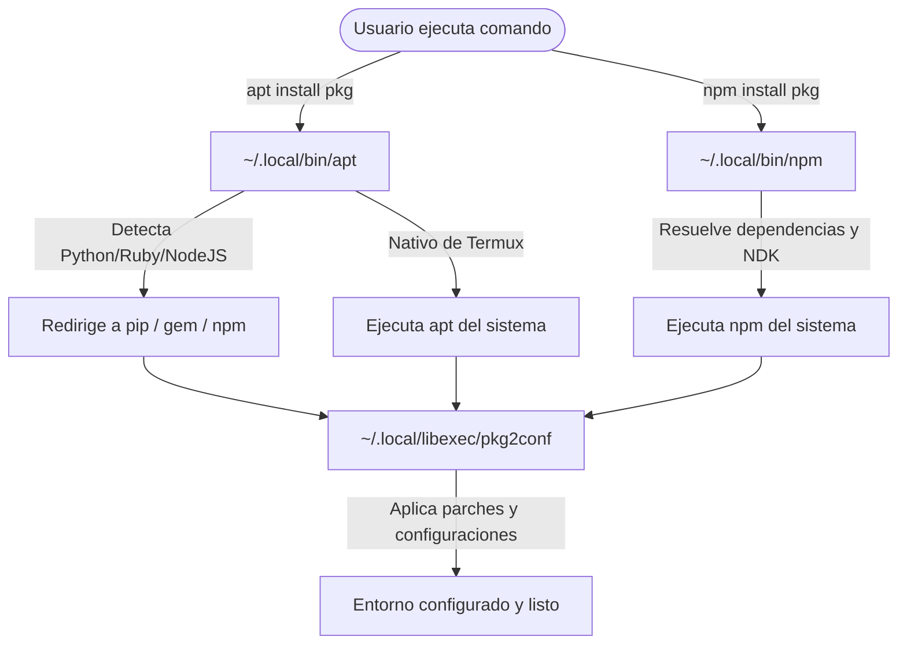

# Gestión de Paquetes en Termux: `pkg` vs `apt` 📦

Una duda recurrente en los canales de soporte es cuándo usar el comando `pkg` y cuándo utilizar `apt`. Aunque ambos interactúan con los mismos repositorios, tienen propósitos y comportamientos distintos en el entorno de Termux.

## El comando `pkg` (El gestor nativo de Termux)
`pkg` es un *wrapper* o envoltorio escrito en Bash desarrollado específicamente para Termux. Invoca internamente a `apt` pero realiza optimizaciones críticas automáticas.

### Ventajas de usar `pkg`:
1. **Actualización automática de fuentes:** Cada vez que ejecutas `pkg install <paquete>`, el script verifica y refresca automáticamente la lista de repositorios locales de manera rápida, previniendo errores de descarga `404`.
2. **Selección automática de espejos:** Elige los servidores réplica (mirrors) más cercanos o disponibles.
3. **Manejo simplificado:** Reduce la necesidad de escribir comandos compuestos largos.

### Comandos Comunes:
* Instalar un paquete: `pkg install <nombre>`
* Desinstalar un paquete: `pkg uninstall <nombre>`
* Buscar un paquete: `pkg search <palabra_clave>`

---

## El comando `apt` (Advanced Package Tool)
`apt` es el gestor clásico heredado de distribuciones Linux de la familia Debian. 

### Características de `apt` en Termux:
* **Mayor control:** Permite realizar operaciones avanzadas como purgar archivos de configuración residuales (`apt purge`), o manejar dependencias de forma quirúrgica.
* **Riesgo de desincronización:** Si ejecutas `apt install <paquete>` sin haber hecho previamente un `apt update`, el comando fallará si las firmas o versiones del repositorio cambiaron en el servidor remoto.

### Comandos Comunes:
* Actualizar lista de repositorios: `apt update`
* Actualizar todo el sistema: `apt upgrade` o `apt full-upgrade`

---

## 📌 La Regla de Oro de i-HakLab
Para evitar la corrupción de dependencias y garantizar que herramientas como `git`, `python`, `fzf` o `gawk` se instalen sin conflictos de firmas en Android:

> **Usa siempre `pkg install` para instalar herramientas individuales y utiliza `apt update && apt upgrade` únicamente durante el mantenimiento general de la terminal.**

---

## 🚀 3. Automatización de Paquetes en i-HakLab: Los Wrappers e Interceptores

El entorno interactivo de **i-HakLab** implementa una capa de automatización inteligente sobre la gestión de paquetes nativa de Termux. Para lograr esto, la suite instala **interceptores o wrappers** en la ruta local del usuario (`~/.local/bin/`) que sustituyen y redirigen las llamadas de comandos de `apt` y `npm`.

Esta arquitectura permite instalar herramientas complejas de ciberseguridad y automatización de forma desatendida sin lidiar con dependencias rotas de Android.



### A. El Wrapper de APT (`~/.local/bin/apt`)
Cuando ejecutas `apt install <herramienta>`, este wrapper intercepta el nombre del paquete:
1. **Redirección Inteligente**: Detecta si el paquete es en realidad un módulo de otro ecosistema. Por ejemplo:
   * Si es un módulo de Python (ej: `sqlmap`, `shodan`, `mvt`, `frida`), cancela el `apt` nativo y lo redirige automáticamente a `python3 -m pip install`.
   * Si es un módulo global de Node.js (ej: `n8n`, `localtunnel`, `claude-code`, `gemini-cli`), lo desvía a `npm install -g`.
   * Si es una gema de Ruby (ej: `bettercap`, `aquatone`), lo redirige a `gem install`.
2. **Ejecución del Sistema**: Si el paquete es nativo, llama al binario original (`/data/data/com.termux/files/usr/bin/apt`).
3. **Fase de Autoconfiguración**: Si la instalación finaliza con éxito y el paquete requiere configuraciones post-instalación de la suite, invoca al orquestador **`pkg2conf`**.

### B. El Wrapper de NPM (`~/.local/bin/npm`)
Muchos módulos globales de Node.js fallan al compilarse en Android por diferencias en la ubicación de librerías del sistema o falta del NDK. El wrapper `npm` corrige esto de antemano:
* **Resolución de pre-requisitos de `n8n`**: Si instalas `n8n`, el wrapper instala previamente los paquetes nativos `nodejs-lts`, `libsqlite`, `sqlite`, y los módulos globales de compilación `pm2` y `node-gyp`. Además, genera automáticamente archivos temporales `.gyp/include.py` con variables NDK vacías para anular fallos del compilador.
* **Soporte de `pnpm`**: Configura corepack y escribe las rutas binarias necesarias en los archivos de perfil de la shell (`.bashrc`, `.zshrc`, `config.fish`).
* **Parcheo de código**: Lanza `pkg2conf` al finalizar la instalación.

---

## ⚙️ 4. El Orquestador de Post-Instalación: `pkg2conf` (`~/.local/libexec/pkg2conf`)

El script **`pkg2conf`** es un motor en Bash encargado de parchear el código fuente, crear enlaces simbólicos de configuración y arrancar demonios de forma desatendida tras la instalación de un paquete. 

A continuación se detallan algunos de los parches y configuraciones críticas que realiza de forma automatizada por paquete:

| Paquete / Herramienta | Acción de Automatización Realizada por `pkg2conf` |
| :--- | :--- |
| **`@google/gemini-cli`** | Parchea el archivo `index.js` del módulo `clipboardy` para corregir un fallo en la detección del portapapeles de Android en Termux (reemplaza `===` por `!==` en la lógica de android). |
| **`mvt` (Mobile Verification)** | Resuelve dependencias de criptografía vía `apt` e introduce dos parches: descarga un archivo `base.py` reparado para evitar un error de identación de Python y modifica `adb_device.py` para capturar fallos genéricos al importar conexiones USB en Android. |
| **`neovim` / `vim`** | Crea las carpetas de configuración, descarga una plantilla configurada de plugins y LSPs (`nvim.zip` / `setvim.zip`), la extrae, instala librerías de lenguajes vía npm/pip y ejecuta de forma desatendida la instalación interna de complementos. |
| **`mariadb`** | Realiza una configuración segura automatizada: arranca temporalmente el motor omitiendo las tablas de privilegios (`--skip-grant-tables`), asigna y encripta una clave por defecto para el usuario `root` (`root`), habilita el plugin `mysql_native_password`, y levanta el servicio de forma segura. |
| **`gdb`** | Clona la extensión de análisis gráfico/depuración **`peda`** en las carpetas de la suite y agrega la directiva de carga automática `source` en el archivo local `~/.gdbinit`. |
| **`tmux` / `zsh` / `bash` / `fish`** | Descarga plantillas de configuración y temas de la suite, realiza respaldos de tus archivos anteriores, crea enlaces simbólicos a las rutas activas y clona plugins de autocompletado y colores de manera automatizada. |
| **`apache2` / `phpmyadmin`** | Descarga configuraciones HTTP seguras, borra los archivos por defecto de la ruta del sistema de Termux y los reemplaza por enlaces simbólicos a los archivos de configuración de la suite local (`~/.local/etc/`). |
| **`youtubedr`** | Genera una configuración de credenciales en `~/.netrc` y crea un script de intercepción multimedia nativo en `/data/data/com.termux/files/usr/bin/termux-url-opener`. |
| **`localtunnel`** | Parchea el módulo global reemplazando el archivo `openurl.js` por una versión compatible descargada del servidor para evitar fallos de apertura de enlaces en consola. |
| **`tor` / `privoxy` / `proxychains-ng`** | Vincula las configuraciones a través de enlaces simbólicos y enlaza Privoxy con el puerto socks5 local de Tor (`127.0.0.1:9050`) para enrutar el tráfico de forma automatizada. |

---

## 📦 5. Repositorios Adicionales de Paquetes

Además del repositorio `stable` oficial de Termux, existen repositorios comunitarios que agregan cientos de herramientas, librerías y adaptaciones para Android:

| Repositorio | Descripción | Instalación |
|---|---|---|
| **`termux-x11`** | Paquetes para entornos gráficos X11 en Termux (servidor X, escritorios, GUI toolkit) | `pkg install termux-x11-nightly` |
| **`tur-repo`** (Termux User Repository) | Repositorio comunitario con paquetes científicos, juegos, y herramientas avanzadas | `pkg install tur-repo` |
| **`glibc-repo`** | Paquetes compilados contra glibc (en lugar de bionic) para compatibilidad con Linux estándar | `pkg install glibc-repo` |
| **`root-repo`** | Repositorio root: paquetes experimentales y que requieren permisos elevados | `pkg install root-repo` |
| **`x11-repo`** | Repositorio de aplicaciones y librerías gráficas X11 | `pkg install x11-repo` |

### Paquetes de infraestructura disponibles

| Paquete | Propósito |
|---|---|
| `termux-am`, `termux-am-socket` | Gestión de actividades y servicios de Android |
| `termux-api`, `termux-api-static` | API de Android desde terminal (cámara, sensores, etc.) |
| `termux-apt-repo` | Creación de repositorios apt personales |
| `termux-auth` | Autenticación biométrica y de contraseña |
| `termux-core`, `termux-core-static` | Librerías base del ecosistema Termux |
| `termux-create-package` | Empaquetado de paquetes .deb para Termux |
| `termux-desktop-xfce` | Configura e instala el entorno gráfico XFCE4 para Termux-X11 |
| `termux-docker-qemu` | Crea una MV con Linux ligero (Alpine) vía QEMU para obtener usuario root real sin proot |
| `termux-elf-cleaner` | Limpieza de binarios ELF para compatibilidad Android |
| `termux-exec`, `termux-exec-glibc`, `termux-exec-static` | Soporte de ejecución de scripts shebangs |
| `termux-gui-bash`, `termux-gui-c`, `termux-gui-package`, `termux-gui-pm` | Bindings de GUI nativa de Termux |
| `termux-install` | Instalador de paquetes .deb offline |
| `termux-keyring` | Llaves GPG para verificación de paquetes |
| `termux-licenses` | Licencias de paquetes Termux |
| `termux-services` | Gestión de servicios (init.d style) |
| `termux-tools` | Herramientas base de Termux (termux-info, termux-setup, etc.) |
| `udocker` | Docker para Termux sin necesidad de root (ejecuta contenedores en espacio de usuario) |

---

## 🐍 6. Paquetes Python Precompilados para Android (vía `apt`/`pkg`)

Muchos módulos de Python requieren compilación en C/C++ que puede fallar en Android o tardar horas. Los siguientes paquetes ya están adaptados (compilados para ARM64/aarch64) y disponibles directamente desde los repositorios de Termux. Al instalarlos con `pkg install`, evitas compilar desde código fuente:

### Repositorio `stable` (oficial Termux)

```
python-apsw
python-apt
python-bcrypt
python-brotli
python-cmake
python-contourpy
python-cryptography
python-ensurepip-wheels
python-greenlet
python-grpcio
python-lameenc
python-libsass
python-llvmlite
python-lxml
python-msgpack
python-numpy
python-numpy-static
python-onnxruntime
python-pillow
python-psutil
python-pyarrow
python-pycryptodomex
python-pynvim
python-pyppmd
python-ruff
python-sabyenc3
python-skia-pathops
python-static
python-tflite-runtime
python-tkinter
python-tldp
python-torch
python-torch-static
python-torchaudio
python-torchcodec
python-torchvision
python-trash-cli
python-xcbgen
python-xlib
python-yt-dlp
python2
python2-static
```

### Repositorio `tur-repo` / `tur-packages` (comunitario)

```
python-cairo
python-fitsio
python-future
python-is-python3.7
python-is-python3.8
python-is-python3.9
python-is-python3.10
python-is-python3.11
python-kivy
python-mitmproxy-wireguard
python-opengl
python-pandas
python-polars
python-polars-runtime-32
python-polars-runtime-64
python-polars-runtime-compat
python-pygame
python-pywavelets
python-scikit-image
python-scipy
python-scipy-2
python-scipy-static
python-seledroid
python-selenium-is-seledroid
python-tiktoken
python-tls-client
python-tokenizers
python2-numpy
python2-numpy-static
python2-scipy

# Versiones específicas de Python 3
python3.7, python3.7-static, python3.7-tkinter, python3.7-cross
python3.8, python3.8-static, python3.8-tkinter, python3.8-cross
python3.9, python3.9-static, python3.9-tkinter, python3.9-cross
python3.10, python3.10-static, python3.10-tkinter, python3.10-cross
python3.11, python3.11-static, python3.11-tkinter, python3.11-cross
```

### Repositorio `termux-x11` (gráficos)

```
opencv-python
python-opencv-python
python-pyqtwebengine
python-qscintilla
python-xapp
```

### Repositorio `glibc-repo` (compatibilidad Linux)

```
python-glibc
python-glibc-static
python-pip-glibc
python-py3c-glibc
python-xcbgen-glibc
```

> [!TIP]
> Antes de instalar paquetes de repositorios adicionales, habilítalos con:
> ```bash
> pkg install tur-repo x11-repo termux-x11-nightly glibc-repo
> pkg update
> ```

