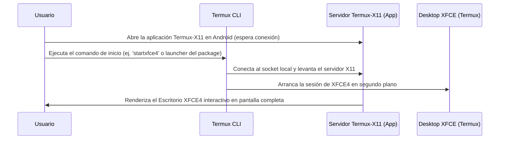

# Interfaz Gráfica Avanzada: Termux-X11 y Desktop XFCE 🖥️🎨

Aunque Termux destaca por su potencia en la línea de comandos, muchas tareas de desarrollo (como el testing de navegadores, visualización de interfaces de usuario o herramientas de análisis gráfico) requieren un entorno de escritorio completo. 

El ecosistema **i-HakLab** implementa **`termux-x11`** como el estándar de renderizado de alto rendimiento para interfaces gráficas en Android, automatizado mediante el paquete **`termux-desktop-xfce`**.

---

## 🚀 ¿Por qué Termux-X11 en lugar de VNC?

Tradicionalmente se utilizaban servidores VNC (como TightVNC) combinados con clientes VNC externos en Android para obtener un escritorio gráfico. Sin embargo, VNC sufre de severos problemas de rendimiento:
* **Alta Latencia:** La compresión del buffer de pantalla añade lag en la interacción.
* **Bajo Framerate:** No aprovecha la GPU del dispositivo.
* **Mal Soporte de Audio/Vídeo:** Reproducir contenido multimedia es impracticable.

**`termux-x11`** soluciona esto interactuando directamente a bajo nivel con la pantalla de Android a través de un protocolo de socket Unix dedicado. Esto permite:
1. **Renderizado de GPU Acelerado:** Soporte para OpenGL/ES mediante capas de emulación como VirGL, Turnip o Zink (permitiendo incluso ejecutar juegos 3D de Linux).
2. **Latencia Ultra Baja:** Se siente como una aplicación nativa de Android.
3. **Integración Completa:** Sincronización automática del portapapeles, redimensionamiento de pantalla dinámico y soporte para gestos táctiles multitáctiles.

---

## 🛠️ Automatización con `termux-desktop-xfce`

Configurar manualmente un entorno de escritorio X11 requiere instalar el servidor, el gestor de ventanas, las fuentes, los servicios de sesión y configurar variables de entorno como `DISPLAY`. 

El paquete **`termux-desktop-xfce`** (incluido en el repositorio personalizado de **termux-packages**) automatiza por completo este proceso:

### 1. Instalación de Componentes
Para desplegar el entorno gráfico en tu terminal, ejecuta:
```bash
pkg install termux-x11 termux-desktop-xfce
```

### 2. Flujo de Trabajo para Iniciar la Sesión Gráfica



### 3. Comandos de Inicialización Manual (Detrás de Escena)
El paquete `termux-desktop-xfce` expone accesos directos, pero técnicamente realiza el siguiente arranque coordinado:

```bash
# 1. Iniciar el servidor X11 de Termux en segundo plano indicando el Display
termux-x11 :1 -xstartup "dbus-launch --exit-with-session xfce4-session" &

# 2. Abrir la aplicación de Android para capturar el buffer gráfico
am start --user 0 -n com.termux.x11/com.termux.x11.MainActivity
```

---

## 📌 Optimización y Atajos de Uso

* **Resolución Dinámica:** Dentro de la aplicación Android de Termux-X11, puedes configurar la escala para adaptar el escritorio a pantallas de tablets o smartphones de alta densidad (ajustando la variable DPI).
* **Aceleración VirGL (GPU):** Si tu procesador soporta OpenGL ES, puedes iniciar aplicaciones pesadas forzando la aceleración de hardware:
  ```bash
  GALLIUM_DRIVER=virpipe virgl_test_server_android &
  # Luego ejecuta tu app gráfica:
  DISPLAY=:1 gallery_app
  ```
